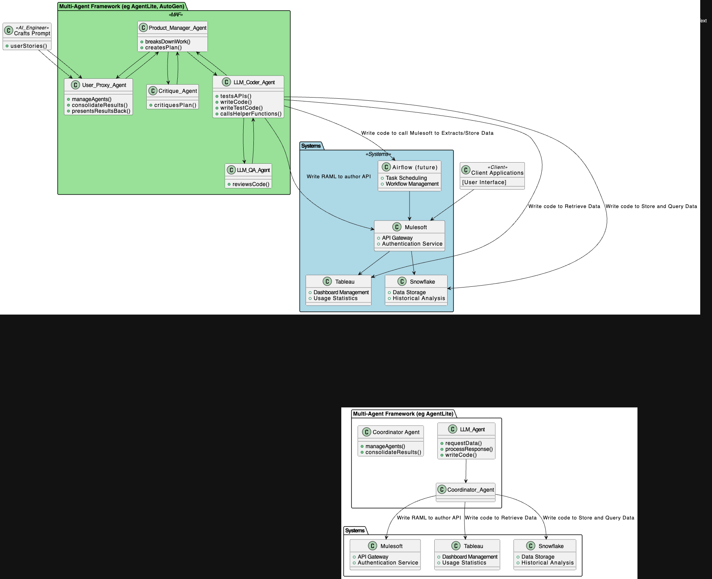
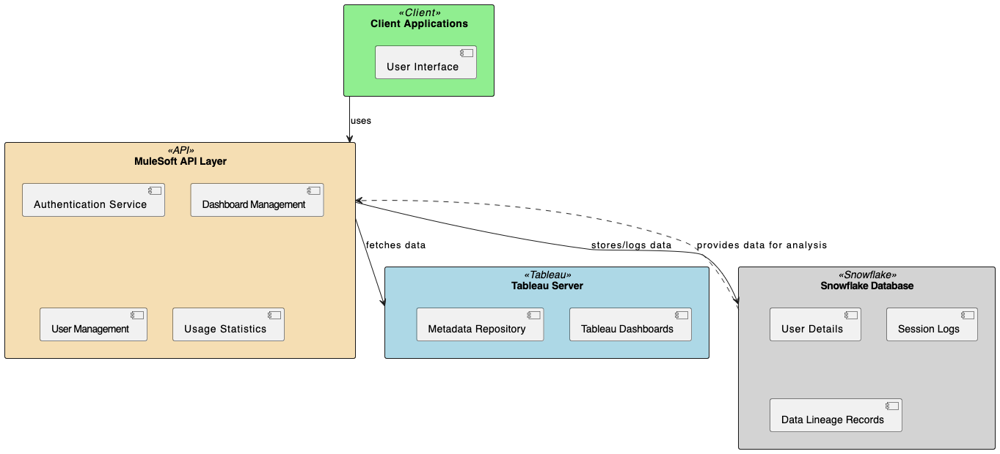

# Dashboard Engagement Project

##### Author: Omer Ansari
##### Initialize date: 5.27.24

### Summary 
The code repository where I document the experience and learnings from developing a medium complexity software project using an LLM-based multi-agentic framework. 
Specifically, this software project is focused on building out an API which serves engagement statistics of dashboards used by a firm for useful operational and analytical purposes.

This project has been opensourced under the Apache license.

_Multi-Agent-Framework SW Design Created from this [plantUML](docs/maf_orch.puml)_

### Business Goal: 
I want to be able to easily pull real-time or historical, usage activity of visualization dashboards being used, such as the number of users logged in, or the names and other metadata (org,title etc) of the users. Operationally this is helpful to know when we need to make administrative changes to these dashboards, or when there is an outage going on we can pull from histoical data to see the details on counts and peoeple who were last logged on before this issue started. 

Analytically this has use cases in identifying what are top N dashboards and the bottom N dashboards in terms of engagement and importance. This helps reduce dashboard sprawl, and also helps identify which dashboards are the most important for any firm so internal customer workshops can be run (based on top users) , get their feedback for improvements, gripes and other enhancements. Another analytical utility is to tie this dashboard engagement metadata with data lineage in any data warehouse. Typically, lineage stops at the target table and many mid/large companies are unaware of the exact importance of the data being pulled from the source in terms of which dashboards are using them, who is actually consuming that data, and the changing usage and demographics of the dashboard's internal customer base.

### Technical Goal:
The application is not that complicated to build. However, I want to build this application differently!

I'll be using (generative AI) LLM-based multi-agent frameworks (MAFs). The reason behind this is to experiment and measure the gaps in developing software projects using the state of the art generative AI frameworks today. The only way to deeply  understand these gaps is to attempt a real-world project. 

I anticipate that there is specific amount of pre-work required to be done by humans to make these MAFs actually useful, which can include setting up a backing database for persistent storage, setting up the MAF (such as crew.ai, agentlite, autogen), choosing the appropriate LLM (GPT4, Gemini, or Open source LLMs), writing tools (helper functions) for LLMs to access the various systems human developers and product managers typically interact with, and also identifyng the level of grain needed for prompt construction to get decent work output including the appropriate AI agent team roles required to be set up. This is an initial up front cost of setup for sure, but I predict that once this is set up, this "team-in-a-box" approach can start yielding multiple applications with relatively lower lift.

Back to this project:

### Overall Software Design

_SW Design Created from this [plantUML](docs/maf_orch.puml)_

I designed this plantUML initially by prompting GPT4, and then fine-tuning the resulting plantUML file until I got the connections right.

### Hypothesis of this project
If robust APIs exist for the dashboard, the backing database and the API platform (and the pre-work has been done to to make these LLM MAFs useful), we can let these MAFs explore, test, and deploy these APIs themselves with a little human tuning along the way. 

Then, replacing the technologies with any others would be straightforward since the actual interaction with these back end systems will be coded by these brilliant LLMs.

However, we have to start somewhere, so I have chosen a few backend technologies to ground this testing. I have however done some rudimentary assessment using GPT on where this project can be expanded into other technologies and linked those below

### Tech used

- **Dashboard platform:** Tableau. _other [possibilities](docs/dashbard_platforms.md)_
- **API platform:** Mulesoft. _other [possibilities](docs/api_platforms.md)_
- **Backing database:** Snowflake.  _other [possibilities](docs/db_platforms.md)_
- **Multi-Agent framework:** Agentlite. _other [possibilities](docs/mafs.md)_

### API spec

Here, I've shown a possible sample API specification and well as implementation steps and milestones. This took about 45 minutes total, and I didn't fine tune the project plan too much. it did give me a general idea to create my todo [list](todo.md) which is what i'm really keying off of to create this project.

To create these, I interacted with the Software Architect GPT (By V B Wickramasinghe) available as one of the many fine-tuned models within chatgpt.com (available if you have a paid subscription). I suspect I'd have gotten similar output interacting with the generic pre-trained model as well, but likely would have had to spend a lot more turns to get it right.

- API [specification](docs/api_spec.md)
- Generic Project [implementation steps and milestones](docs/milestones.md)

### Software Design for Project

The following is a basic diagram to illustrate the architecture of the API application that interfaces with the Tableau platform and utilizes Snowflake for storage. This diagram will include the main components such as the MuleSoft API layer, the Tableau Server, and the Snowflake database, showing how they interact.

_SW Design Created from this [plantUML](docs/sw_arch.puml)_

To create the diagram in the software architecture, I used Tim Kitchen's excellent youtube [video](https://www.youtube.com/watch?v=YaqXF5UeRQE) where he shows how to use GPT to build software design documents using plantuml and then feed them to draw.io.

### Explanation of Diagram Components:

- **Client Applications**: Represents the front-end applications or other systems that will be consuming the API. This could include internal operational tools, dashboard management interfaces, etc.

- **MuleSoft API Layer**: The core of the system, where all the logic for interfacing with Tableau and Snowflake is implemented. This includes:
  - **Authentication Service**: Manages client authentication and authorization.
  - **Dashboard Management**: Handles requests related to dashboard data fetching and analysis.
  - **User Management**: Manages user data fetching and manipulation.
  - **Usage Statistics**: Processes and provides statistics on dashboard usage and user activity.

- **Tableau Server**: This is where the Tableau dashboards are hosted. The API layer interacts with Tableau to retrieve dashboard data and metadata.

- **Snowflake Database**: Used for storing detailed logs, user information, and other persistent data necessary for historical analysis and data lineage.

This diagram provides a visual breakdown of how each component of the API interacts with others, supporting better understanding and communication among stakeholders involved in the project.

### Design for the Multi-Agent-Framework developing the application

The above was the software that this project is striving to create. In this section, what you see is the actual multi-agent-framework which will be used to develop this application

_Multi-Agent-Framework SW Design Created from this [plantUML](docs/maf_orch.puml)_

### AI Engineer
- Crafts Prompt: Creates and manages user stories.

### Client Applications
The frontend interface for user interactions.

### Multi-Agent Framework (MAF)
- **Product Manager Agent**: Breaks down work and creates plans.
- **Critique Agent**: Reviews and critiques the plans.
- **LLM QA Agent**: Ensures the quality of the code.
- **LLM Coder Agent**: Tests APIs, writes code, writes test code, and calls helper functions.
- **User Proxy Agent**: Manages agents, consolidates results, and presents results back to the AI Engineer.

### Systems
- **Mulesoft**: Provides an API Gateway and Authentication Service.
- **Tableau**: Manages dashboards and provides usage statistics.
- **Snowflake**: Offers data storage and enables historical data analysis.
- **Airflow (Future)**: Manages task scheduling and workflow management.

### Interactions
The AI Engineer crafts prompts and initiates projects through the User Proxy Agent. The User Proxy Agent manages interactions with the Product Manager Agent, who breaks down the work and creates plans. These plans are sent to the Critique Agent for feedback, then finalized and passed to the LLM Coder Agent for coding. The LLM QA Agent reviews the code for quality, and the final code is sent back to the Product Manager Agent and then to the User Proxy Agent, who consolidates and presents the results back to the AI Engineer.

The LLM Coder Agent interacts with Mulesoft by writing RAML for API authoring, retrieves data through Tableau, stores and queries data with Snowflake, and schedules tasks with Airflow. Mulesoft acts as the API Gateway connecting to both Tableau and Snowflake, while Airflow interacts with Mulesoft for running batch jobs to extract date from Tableau and store in a persistent database. Client Applications interface directly with Mulesoft for user interactions.